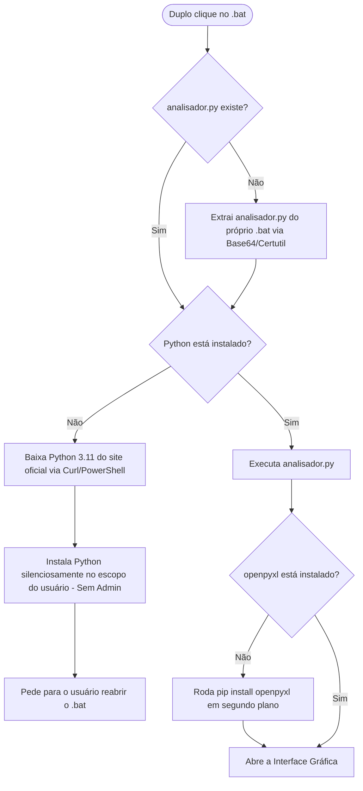

# Analisador de Ocorrências Excel 📊

Este projeto é uma ferramenta leve, robusta e automatizada para analisar registros de números e datas em planilhas do Excel. Ele resolve problemas comuns de compatibilidade em versões antigas do Excel (onde fórmulas dinâmicas como `ÚNICO` e `FILTRAR` não funcionam) ao transferir a lógica de cálculo para uma interface gráfica externa em Python, mantendo a planilha do usuário extremamente simples.

O grande diferencial deste projeto é o seu **mecanismo de execução de clique único** (através de um arquivo `.bat` mestre), que automatiza a instalação do Python, de todas as dependências necessárias e ainda se auto-recupera caso o código principal em Python seja deletado.

---

## 🎯 Propósito do Projeto
Facilitar a consolidação e contagem de ocorrências de números específicos dentro de um intervalo de datas selecionado pelo usuário. 

A ferramenta possui as seguintes regras de negócio inteligentes:
1. **Filtro de Duplicados no Mesmo Dia:** Se um número for registrado mais de uma vez na *mesma data*, o sistema conta apenas como **uma ocorrência** (ignora duplicados no mesmo dia, contando apenas a presença diária do número).
2. **Correção Inteligente de Datas:** Corrige automaticamente pequenos erros de digitação nas datas da planilha (ex: `06/072026` sem a segunda barra é corrigido para `06/07/2026`).
3. **Ordenação Automática:** Exibe os resultados consolidados ordenados de forma decrescente pela quantidade de ocorrências (do número mais frequente para o menos frequente).
4. **Exportação Profissional em PDF:** Permite gerar relatórios em formato PDF com cabeçalho estatístico da consulta (período, arquivo de origem, totais) e tabela com formatação zebrada pronta para impressão ou compartilhamento.

---

## 🛠️ Tecnologias Utilizadas
* **Windows Batch Script (CMD):** Responsável por orquestrar a inicialização, downloads e verificações de ambiente.
* **Python 3:** Linguagem usada para construir o analisador.
  * **Tkinter (GUI):** Interface gráfica nativa para entrada de datas, visualização de tabelas e ações.
  * **Openpyxl:** Leitura e escrita rápida de arquivos `.xlsx`.
  * **ReportLab:** Geração programática de relatórios PDF com tabelas estilizadas e cabeçalhos.
* **Certutil (Nativo do Windows):** Ferramenta utilizada para decodificar o arquivo Python embutido no lote em formato Base64.
* **Curl / PowerShell:** Ferramentas nativas do Windows usadas para baixar o instalador oficial do Python se necessário.

---

## ⚙️ O que o arquivo `iniciar_analisador.bat` faz passo a passo?
Quando o usuário executa o `iniciar_analisador.bat`, o script de lote realiza as seguintes etapas de forma linear:

1. **Auto-Recuperação (Self-Healing):** Verifica se o arquivo `analisador.py` está na pasta. Se não estiver, ele extrai o código Python inteiro de um bloco Base64 embutido no próprio lote usando a ferramenta nativa `certutil.exe`.
2. **Validação do Ambiente Python:** Executa o comando `python --version` para testar se há uma instalação funcional do Python no sistema.
3. **Download e Instalação do Python:** Se o Python não for detectado, o script faz o download do instalador oficial do Python 3.11.9 da `python.org` usando `curl` (ou `powershell` caso o curl não esteja disponível). Em seguida, instala-o silenciosamente (`/quiet`) no escopo do usuário (`InstallAllUsers=0`), eliminando a necessidade de permissão de administrador. Ele adiciona o Python ao PATH do sistema de forma automática.
4. **Instalação das Dependências do Python:** No primeiro arranque, o script Python verifica a presença da biblioteca `openpyxl`. Se não for encontrada, ele a instala em segundos executando o `pip` de forma silenciosa.
5. **Execução Limpa:** Inicia a aplicação usando `pythonw.exe`, o que impede a abertura de uma tela de prompt de comando preta em segundo plano, fazendo o software parecer um executável nativo do Windows.

---

## 🚀 Como Usar
1. Baixe o arquivo `iniciar_analisador.bat` deste repositório e coloque-o na pasta onde deseja gerenciar suas planilhas.
2. Dê **dois cliques** no `iniciar_analisador.bat`.
3. Se você não possuir uma planilha modelo, clique no botão **"Criar Nova Planilha Modelo (.xlsx)"** dentro do programa para salvar um template formatado.
4. Abra a planilha gerada, registre seus dados de número e data na aba `Lançamentos` e salve o arquivo.
5. No programa, selecione o arquivo gerado, defina a **Data Inicial** e a **Data Final** do seu período de análise e clique em **🔍 Analisar Ocorrências**.
6. Para exportar ou imprimir os resultados, clique no botão **📄 Gerar Relatório PDF**, escolha onde deseja salvar e confirme se deseja abrir o relatório imediatamente.
